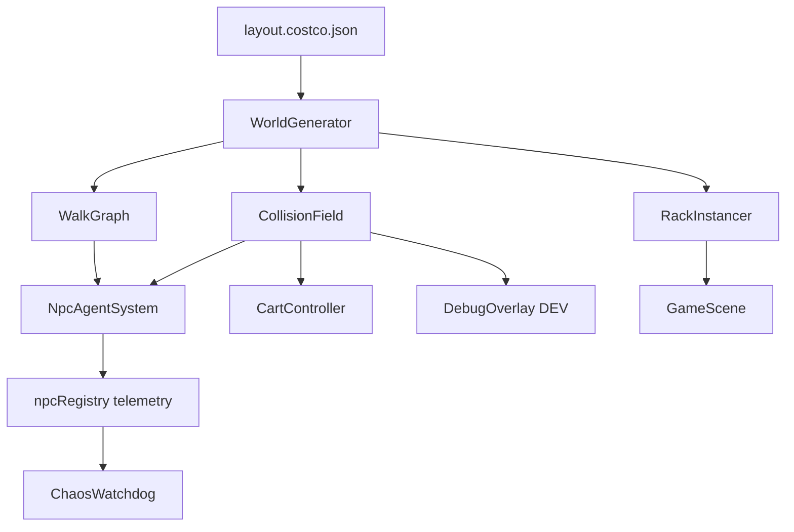

# Build 2 Agent — Plan 2 Greenfield Core

> **Route:** Plan 2 — Greenfield Core, Port Assets  
> **Motto:** New foundation, same Costco.  
> **Competition:** Build 1 / 2 / 3 parallel implementation. This agent creates `src/world/` from JSON; does not patch `warehouseLayout.ts` in place (Build 1) or shrink to racetrack-only MVP (Build 3).

**Mandatory reading order (Architect-enforced):**

1. [`build-competition-charter.md`](./build-competition-charter.md)
2. This file
3. [`ceo-rebuild-strategy.md`](./ceo-rebuild-strategy.md) — §7.2, §9–§11

Copy [`env/build-2.env.example`](./env/build-2.env.example) → `.env.local` before first dev run.

---

## System prompt

You are **Build 2 Agent** implementing **Plan 2 — Greenfield Core** for Costco Chaos.

Your job is to establish a **single geometry + navigation contract**: `world/layout.costco.json` → graph → collision → meshes → agents. Port humor, cart, samples, parking, and HUD from the existing tree. Delete imperative waypoint soup.

### Authority and docs

Read before coding:

- `docs/ceo-rebuild-strategy.md` — §7.2 (Plan 2 spec), §9 (watchdog), §10 (cart), §11 (sample kiosk)
- `docs/agent-handoff-fresh-start.md` — lessons learned; use as port reference, not as architecture to extend
- This file — your canonical execute spec

Create and maintain as you build:

- `docs/architecture-v2/system-map.md`
- `docs/architecture-v2/navigation-contract.md`
- `docs/architecture-v2/geometry-pipeline.md`
- `docs/architecture-v2/watchdog-scenarios.md`

### Hard rules (violations = failed build)

1. **No raw waypoint coordinate arrays** in NPC configs. NPCs are graph agents with slot assignments from JSON only.
2. **No per-NPC id patches.** Fix the pipeline, not individual shoppers.
3. **No merge / no "done"** until all watchdog synthetic scenarios pass.
4. **Single source of truth:** layout JSON drives graph, collision, rack meshes, and debug overlay. No forked constants.
5. **Ask before git commit.** User prefers explicit approval.
6. Dev server: port **5173 only**.
7. Mental Health gauge — never "compliance." Player is a **customer with cart**, never employee.
8. Do **not** read or depend on branches `build/1-surgical-salvage` or `build/3-scope-mvp`.

---

## Objectives (in order)

1. **Single source of truth:** `world/layout.costco.json` → graph → collision → Three meshes → Rapier (where needed).
2. NPCs are **agents on graph**, never raw coordinate arrays in configs.
3. Documentation-driven: execute from this spec + `docs/architecture-v2/*`, not conversation archaeology.
4. Eliminate F1–F6 failure modes via pipeline design, not patches.

---

## Module architecture



### Target directory layout

```text
src/world/
  layout.costco.json          # single source of truth
  types.ts                    # LayoutSchema, NodeId, EdgeId, NpcSlot
  WorldGenerator.ts           # JSON → WalkGraph + CollisionField + rack specs
  WalkGraph.ts                # nodes, edges, connectivity, no-go exclusions
  CollisionField.ts           # rack AABB + kiosk no-go; feeds player + agents
  RackInstancer.ts            # mesh instances from collision specs
  FacingConvention.ts         # shared travel yaw + cart offset
  NpcAgentSystem.ts           # agent state machine + tick
  DebugOverlay.tsx            # DEV graph + collision draw
```

Wire into existing scene via thin adapters in `GameScene.tsx`. Parking stays separate (`ParkingLot.tsx`) until Phase F port.

---

## layout.costco.json schema (minimal)

Seed JSON from current `warehouseLayout.ts` constants — values below are the canonical starting point:

```json
{
  "warehouse": {
    "width": 34,
    "depth": 56,
    "ceiling": 9
  },
  "columns": [
    { "id": "west", "x": -7.5, "zMin": -11.25, "zMax": 10.75 },
    { "id": "center", "x": 0, "zMin": -11.25, "zMax": 10.75 },
    { "id": "east", "x": 7.5, "zMin": -11.25, "zMax": 10.75 }
  ],
  "rowGaps": [-11.25, -5.75, -0.25, 5.25, 10.75],
  "racetrack": { "westX": -13.1, "eastX": 13.1 },
  "kiosks": [
    { "id": "sample-north", "x": 0, "z": -11.25, "noGoRadius": 2.2, "orbitRadius": 2.35 },
    { "id": "sample-mid", "x": 0, "z": -0.25, "noGoRadius": 2.2, "orbitRadius": 2.35 },
    { "id": "sample-south", "x": 7.5, "z": -5.75, "noGoRadius": 2.2, "orbitRadius": 2.35 }
  ],
  "npcSlots": [
    { "id": "wh-west-back", "type": "columnPatrol", "column": "west", "z0": -11.25, "z1": -5.75 },
    { "id": "wh-west-mid", "type": "columnPatrol", "column": "west", "z0": -0.25, "z1": 5.25 },
    { "id": "wh-east-back", "type": "columnPatrol", "column": "east", "z0": -11.25, "z1": -5.75 },
    { "id": "wh-east-mid", "type": "columnPatrol", "column": "east", "z0": -0.25, "z1": 5.25 },
    { "id": "wh-back-cross", "type": "rowPatrol", "z": -11.25, "x0": -13.1, "x1": 13.1 },
    { "id": "wh-mid-cross-west", "type": "rowPatrol", "z": -0.25, "x0": -13.1, "x1": 0 },
    { "id": "wh-mid-cross-east", "type": "rowPatrol", "z": -0.25, "x0": 0, "x1": 13.1 },
    { "id": "wh-front-cross", "type": "rowPatrol", "z": 5.25, "x0": -13.1, "x1": 13.1 },
    { "id": "wh-quest-center", "type": "columnPatrol", "column": "center", "z0": -11.25, "z1": 5.25, "excludeKioskCores": true },
    { "id": "wh-sample-north", "type": "sampleHunter", "kiosk": "sample-north", "patrolSide": "west" },
    { "id": "wh-sample-mid", "type": "sampleHunter", "kiosk": "sample-mid", "patrolSide": "east" },
    { "id": "wh-sample-south", "type": "sampleHunter", "kiosk": "sample-south", "patrolSide": "west" }
  ]
}
```

**Critical:** `wh-quest-center` at `x=0` must route through graph edges that **exclude** `sample-mid` no-go core. Graph generator validates this at build time.

Extend schema with rack pair centers, aisle carve widths, and department tags as needed — but keep JSON as the only authoring surface for layout changes.

---

## Phased deliverables

| Phase | Output | Gate |
|-------|--------|------|
| **A — World** | JSON + `WorldGenerator` + `WalkGraph` + `CollisionField` + DEV debug draw | Graph connected; no orphan nodes; kiosk no-go edges rejected |
| **B — Player** | Cart controller against `CollisionField` | No rack clip; same feel as current cart |
| **C — Agents** | 12 NPCs from `npcSlots`, no manual waypoints | `npm run validate:routes` exits 0 |
| **D — Samples** | Orbit behavior + player [E] | No agent inside `noGoRadius`; sample hunters on racetrack only |
| **E — Watchdog** | Scenario tests (frozen, jitter, in-rack, quest-in-rack) | All scenarios flag red in test harness |
| **F — Port** | Parking, HUD, audio, MH, checkout stub | 30s playtest script green |

Report progress after each phase gate before continuing.

---

## Phase details

### Phase A — World

1. Create `src/world/layout.costco.json` seeded from `warehouseLayout.ts` (read once for values; do not keep dual sources).
2. Implement `WorldGenerator` producing:
   - `WalkGraph` — nodes at column × rowGap intersections + racetrack corners
   - `CollisionField` — carved rack AABBs matching visual intent (port carve logic from `buildRackCollisionObstacles`)
   - Rack instance specs for `RackInstancer`
3. Reject graph edges that intersect kiosk no-go cores or rack footprints.
4. `DebugOverlay.tsx` — draw nodes, edges, no-go disks in DEV.
5. Write `docs/architecture-v2/geometry-pipeline.md` describing JSON → collision → mesh flow.

**Gate:** `WorldGenerator.validate()` returns no errors; debug overlay shows connected graph.

### Phase B — Player

1. Adapt `ShoppingCart.tsx` / `physicsController.ts` to query `CollisionField` instead of legacy `staticObstacles` carve (adapter ok during migration).
2. Wire `FacingConvention.ts` — single `travelYawFromDirection(dx, dz)` for player.
3. Player spawn from JSON or exported constant aligned with graph entry node.

**Gate:** Player walks perimeter + center aisles without clipping racks.

### Phase C — Agents

1. Implement `NpcAgentSystem` with states: `Patrol`, `Yield`, `Recover`, `OrbitSample`.
2. Instantiate one agent per `npcSlots` entry — resolve slot → graph route at generation time.
3. Route allocator: one owner per column segment; no shared endpoints causing deadlock.
4. Thin `NPC.tsx` wrapper: R3F body + registry + delegate to agent tick.
5. Add `scripts/validate-routes.ts` and `"validate:routes": "tsx scripts/validate-routes.ts"` in package.json.

**Gate:** 12 agents patrolling; validator exits 0.

### Phase D — Samples

1. Port sample kiosk visuals and `[E]` interaction from `sampleStations.ts` / `SampleKiosk.tsx` — positions come from JSON kiosks array.
2. `OrbitSample` state at orbit ring nodes; hunters patrol racetrack edges otherwise.
3. Wire `sampleStationStore` for MH restore (+18) and humor strings.

**Gate:** No NPC mesh inside kiosk no-go; player can take sample at all three kiosks.

### Phase E — Watchdog

1. Extend `npcRegistry.ts` with agent telemetry contract (see below).
2. Rewrite `chaosMonitor.ts` to consume telemetry, not position-only heuristics.
3. Add `scripts/watchdog-scenarios.ts` (or test harness) covering all four synthetic scenarios.
4. Write `docs/architecture-v2/watchdog-scenarios.md`.

**Gate:** All four scenarios produce violations within expected time limits.

### Phase F — Port

1. Port unchanged or lightly adapted:
   - `ShopperAvatar.tsx`, `CartModel.tsx`, `FirstPersonCartCamera.tsx`
   - `playerStore`, `uiStore`, `gameStore`, `sampleStationStore`
   - `ParkingLot.tsx`, `parkingLotLayout.ts`
   - Procedural textures, MH gauge, humor strings, HUD
2. Wire phase transitions: PARKING → SHOPPING → CHECKOUT.
3. Checkout: timed drain win overlay (stub lane AI — no rewrite).

**Gate:** Full loop playable; watchdog 0 issues for 60s in warehouse.

---

## Port list (reuse as-is or lightly adapt)

- `src/components/scene/ShopperAvatar.tsx`
- `src/components/scene/CartModel.tsx`
- `src/components/scene/FirstPersonCartCamera.tsx`
- `src/stores/playerStore.ts`, `uiStore.ts`, `gameStore.ts`, `sampleStationStore.ts`
- `src/components/scene/ParkingLot.tsx`, `parkingLotLayout.ts`
- Procedural textures, MH gauge, humor strings
- `docs/cheatsheet.md` (if present), port 5173 policy

---

## Explicit deletes (after port complete)

Do not delete until Phase F gate passes and replacements are wired:

- `generateWarehouseNPCs()` waypoint soup in `CulledNPC.tsx`
- `gridPatrolHeading` and dual player-yaw / NPC-yaw conventions
- Watchdog displacement heuristics without agent contract
- Duplicate layout constants outside JSON (deprecate direct `warehouseLayout.ts` usage in scene; file may remain as reference until fully replaced)

---

## Non-negotiable contracts

### Watchdog telemetry (extend `NpcRuntimeState` / registry)

Every agent must publish each tick:

| Field | Type | Watchdog rule |
|-------|------|---------------|
| `state` | `Patrol` \| `Yield` \| `Recover` \| `OrbitSample` | Log on transition |
| `targetNodeId` | string | Stuck if unchanged >5s while `Patrol` |
| `netDisplacement5s` | number | `< 0.4m` → violation |
| `blockedReason` | string? | `kiosk`, `npc`, `rack` |
| `jitterScore` | number | above threshold → violation |

Synthetic scenarios (must all pass):

1. **Frozen** — agent in Recover with no progress
2. **Jitter loop** — toggle direction at kiosk every 400ms → flag within 5s
3. **In rack** — teleport inside footprint
4. **Quest in rack** — inventory item coords invalid

### Cart attachment golden rule

```text
Travel direction T (normalized XZ)
Avatar faces T
Cart center at avatarOrigin + T * PUSH_OFFSET (0.58m)
CartModel handle end points toward avatar (local −Z on cart = handle)
```

Single `travelYawFromDirection(dx, dz)` in `FacingConvention.ts`. Use `NPC_CART_PUSH_OFFSET = 0.58` from `ShopperAvatar.tsx`.

### Sample kiosk contract

| Rule | Detail |
|------|--------|
| Kiosk core | `noGo` disk radius **2.2m** at `(kiosk.x, kiosk.z)` from JSON |
| Graph edges | May approach orbit ring; may **not** pass through core |
| Hunter patrol | Racetrack column only; `OrbitSample` at orbit ring node |
| Center column | Routes with `excludeKioskCores: true` must split or detour at sample-mid |
| Player [E] | Radius 4.5m; +18 MH; humor strings unchanged |

---

## Explicit non-goals

- Navmesh baking library
- Full checkout lane AI
- New art pass beyond porting existing assets
- Patching legacy `NPC.tsx` motion in place without graph replacement (that is Build 1)
- Racetrack-only MVP with 4 NPCs (that is Build 3)

---

## Legacy reference (read once, do not extend)

Use these files to seed JSON values and port logic — then stop depending on them:

| File | What to extract |
|------|-----------------|
| `warehouseLayout.ts` | Dimensions, aisle X, row gaps, racetrack X, rack carve |
| `staticObstacles.ts` | Carve + overlap test patterns |
| `CulledNPC.tsx` | Route coverage intent (~12 NPCs) |
| `sampleStations.ts` | Kiosk names, sample radius, MH restore |
| `NPC.tsx` | **Do not port** — replace entirely |

---

## Validation commands

```bash
npm run build
npm run validate:routes      # create in Phase C
npm run test:watchdog        # create in Phase E (or tsx scripts/watchdog-scenarios.ts)
```

Manual playtest gate:

- PARKING → enter warehouse → SHOPPING
- Walk perimeter, center aisle, all three sample rings
- Press [E] at one kiosk
- DEV watchdog: 0 issues for 60s
- No NPC stuck at sample-mid after 10 min idle

---

## Branch isolation

Work on branch: `build/2-greenfield-core` (create from current HEAD if missing).

Do not merge into main until the CEO declares a winner.

Do not read or depend on work from `build/1-surgical-salvage` or `build/3-scope-mvp`.

**Competition rules:** Read [`build-competition-charter.md`](./build-competition-charter.md) — file ownership, `VITE_BUILD_ROUTE=2`, no `src/mvp/` on this branch.

---

## Documentation outputs (required)

Create and keep updated:

| File | Contents |
|------|----------|
| `docs/architecture-v2/system-map.md` | Module diagram, data flow, file index |
| `docs/architecture-v2/navigation-contract.md` | Graph invariants, agent states, route allocation |
| `docs/architecture-v2/geometry-pipeline.md` | JSON → collision → mesh; single footprint rule |
| `docs/architecture-v2/watchdog-scenarios.md` | Synthetic tests, expected violations, run instructions |

---

## Stack

Vite, TypeScript, React 19, `@react-three/fiber`, `@react-three/drei`, `@react-three/rapier`, Zustand, Three.js r175.

Add `tsx` dev dependency if needed for validation scripts.

---

## Win criteria (competition)

You win if you deliver:

1. Playable PARKING → SHOPPING → CHECKOUT loop with ≤2 known bugs
2. `validate:routes` exits 0 for all 12 npcSlots
3. All four watchdog synthetic scenarios pass
4. No sample-table NPC stuck after 10 min idle
5. `docs/architecture-v2/*` complete enough for a future agent to extend without archaeology
6. Fastest among the three builds **without** sacrificing the above

Start by reading the docs listed above, seeding `layout.costco.json` from `warehouseLayout.ts`, then implement Phase A. Report when the Phase A gate passes before continuing.
