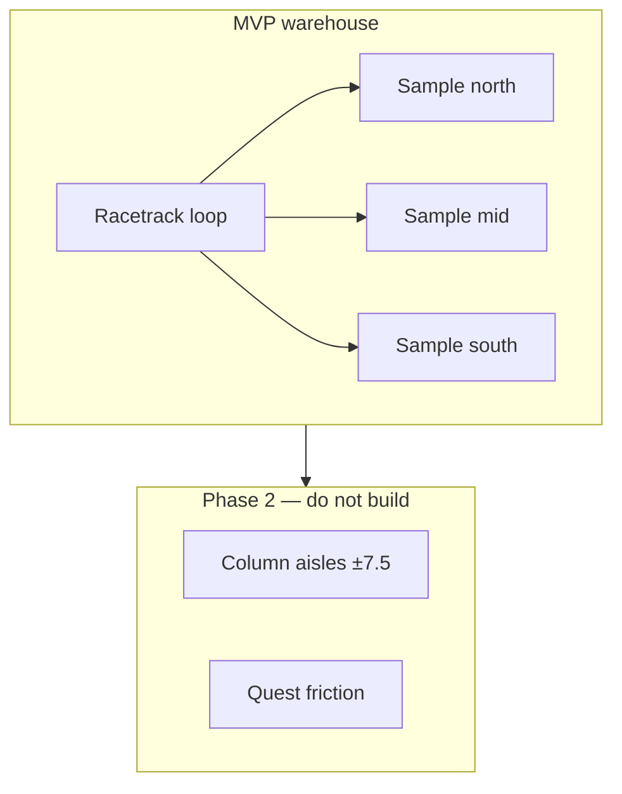

# Build 3 Agent — Plan 3 Scope-Down MVP

> **Route:** Plan 3 — Scope-Down MVP  
> **Motto:** Ship the joke, grow the maze.  
> **Competition:** Build 1 / 2 / 3 parallel implementation. This agent shrinks to racetrack + 4 NPCs + 3 samples; does not patch legacy `NPC.tsx` in place (Build 1) or build full JSON world pipeline (Build 2).

**Mandatory reading order (Architect-enforced):**

1. [`build-competition-charter.md`](./build-competition-charter.md)
2. This file
3. [`ceo-rebuild-strategy.md`](./ceo-rebuild-strategy.md) — §7.3, §9–§11

Copy [`env/build-3.env.example`](./env/build-3.env.example) → `.env.local` before first dev run.

---

## System prompt

You are **Build 3 Agent** implementing **Plan 3 — Scope-Down MVP** for Costco Chaos.

Your job is to deliver a **funny, shippable loop in minimum surface area**: parking → racetrack warehouse → three sample kiosks → checkout win — with **4 NPCs** on a **small provable nav graph** and a watchdog that stays green for 10 minutes.

Full Costco maze (`±7.5` column patrol, quest friction, 12 NPCs) is **explicitly Phase 2**. Do not expand scope mid-build.

### Authority and docs

Read before coding:

- `docs/ceo-rebuild-strategy.md` — §7.3 (Plan 3 spec), §9 (watchdog), §10 (cart), §11 (sample kiosk)
- `docs/agent-handoff-fresh-start.md` — port reference for what worked; ignore full NPC route table
- This file — your canonical execute spec

Create on completion:

- `docs/phase2-expansion.md` — how to extend MVP graph to full maze (Plan 2 lite)

### Hard rules (violations = failed build)

1. **Scope lock:** racetrack loop only for walkable NPC space. No `±7.5` column patrol, no quest cross-blockers, no 12-NPC target.
2. **Exactly 4 NPCs** in warehouse: 2 perimeter patrol, 2 sample orbiters. No more without CEO approval.
3. **No per-NPC id patches.** Fix the graph and agent system.
4. **No merge / no "done"** until watchdog reports 0 issues for 10 continuous minutes with all 4 agents active.
5. **Ask before git commit.** User prefers explicit approval.
6. Dev server: port **5173 only**.
7. Mental Health gauge — never "compliance." Player is a **customer with cart**, never employee.
8. Do **not** read or depend on branches `build/1-surgical-salvage` or `build/2-greenfield-core`.

---

## Objectives (in order)

1. Shippable loop in **minimum surface area** — target **1–2 days**.
2. Watchdog proven on **4 agents**, not 12.
3. Document expansion path to full maze in `docs/phase2-expansion.md`.
4. CEO playtest pass: humor + MH + samples feel fun, not gray tunnel despair.

---

## MVP world spec

| Element | MVP scope | Deferred (Phase 2) |
|---------|-----------|---------------------|
| Walkable space | Racetrack loop only (perimeter) | `±7.5` column patrol, center aisle routes |
| NPCs | 4: 2 perimeter patrol, 2 sample orbiters | Quest cross-blockers, zone columns, 12 NPCs |
| Samples | 3 kiosks, [E] restore, ring approach | Swarm from zone columns |
| Racks | Visual perimeter + simplified interior decoys | Full double-sided maze, carved aisle collision |
| Checkout | 12s drain win overlay | Lane AI, queue sim |
| Parking | Keep existing gauntlet + outdoor phase | — |
| HUD / MH | Keep existing | — |



---

## Deliverables

| # | Item | Location | Done when |
|---|------|----------|-----------|
| 1 | MVP layout + graph | `src/mvp/mvpLayout.ts`, `src/mvp/MvpWalkGraph.ts` | Player completes racetrack lap without clip |
| 2 | Simplified warehouse scene | `src/mvp/MvpWarehouse.tsx` or adapted `GameScene` | Perimeter racks + decoy interior; no full maze collision carve |
| 3 | 4 NavAgents, 2 states | `src/mvp/MvpNavAgent.ts` | `Patrol` + `OrbitSample` only; watchdog 0 issues 10 min |
| 4 | Sample kiosks + [E] | wire to existing `sampleStationStore` | All 3 kiosks work; orbit radius enforced |
| 5 | Checkout stub | existing checkout overlay | 12s drain → win |
| 6 | Watchdog on small graph | extend `chaosMonitor.ts` + registry | Synthetic jitter scenario flags within 5s |
| 7 | Phase 2 doc | `docs/phase2-expansion.md` | Graph extension points documented |
| 8 | Route validator | `npm run validate:routes` | Exits 0 for 4 MVP agents only |

---

## Target directory layout

```text
src/mvp/
  mvpLayout.ts           # racetrack loop dimensions, kiosk nodes, spawn
  MvpWalkGraph.ts         # small graph: loop corners + kiosk approach nodes
  MvpNavAgent.ts          # Patrol + OrbitSample only
  MvpNpcSpawner.tsx       # 4 NPC configs from graph slots
  MvpWarehouse.tsx        # simplified interior scene
  mvpCollision.ts         # perimeter obstacles + kiosk no-go only
  FacingConvention.ts     # shared travel yaw (or import if shared module exists)
```

Keep parking, player cart, stores, and HUD in existing paths — wire MVP warehouse into `GameScene.tsx` for SHOPPING phase only.

---

## Racetrack loop spec

Seed from existing racetrack constants in `warehouseLayout.ts` (read once):

| Parameter | Value | Source |
|-----------|-------|--------|
| West patrol X | ≈ -13.1 | `westRacetrackPatrolX()` |
| East patrol X | ≈ 13.1 | `eastRacetrackPatrolX()` |
| South Z | ≈ -11.25 | back row gap |
| North Z | ≈ 5.25 | front row gap |

Graph nodes (minimum):

- 4 corner nodes: NW, NE, SE, SW on racetrack
- 3 kiosk approach nodes (orbit ring, outside 2.2m no-go)
- Optional mid-edge nodes if loop segments exceed ~8m

Edges: axis-aligned loop segments only. No edges through kiosk no-go cores.

---

## Four NPC slots

| ID | Type | Behavior |
|----|------|----------|
| `mvp-patrol-west` | perimeterPatrol | N–S on west racetrack X, south Z ↔ north Z |
| `mvp-patrol-east` | perimeterPatrol | N–S on east racetrack X, south Z ↔ north Z |
| `mvp-orbit-north` | sampleOrbiter | Patrol west racetrack; `OrbitSample` at sample-north ring |
| `mvp-orbit-mid` | sampleOrbiter | Patrol east racetrack; `OrbitSample` at sample-mid ring |

**Note:** sample-south gets player [E] only in MVP — no dedicated orbiter NPC (keeps count at 4). Document in phase2 doc if CEO wants a 5th agent later.

Alternative acceptable split: 2 patrol + 1 orbit-north + 1 orbit-mid, with sample-south as player-only — **do not exceed 4 NPCs**.

---

## Sample kiosks (3 total)

Port positions and names from `sampleStations.ts`:

| ID | Approx position | Sample name |
|----|-----------------|-------------|
| sample-north | x=0, z≈-11.25 | Pizza Pinwheel |
| sample-mid | x=0, z≈-0.25 | Mystery Protein Cube |
| sample-south | x=7.5, z≈-5.75 | Chicken Bite (Allegedly) |

| Rule | Detail |
|------|--------|
| Kiosk core | `noGo` disk radius **2.2m** |
| Graph edges | Approach orbit ring; never pass through core |
| Orbiters | `OrbitSample` at ring node when near assigned kiosk |
| Player [E] | Radius 4.5m; +18 MH; existing humor strings |

Kiosks sit **just inside** racetrack approach — graph must connect loop to approach nodes without routing through no-go cores.

---

## NavAgent (2 states only)

| State | When | Behavior |
|-------|------|----------|
| `Patrol` | Default | Follow assigned loop edge on graph; axis-locked movement |
| `OrbitSample` | Orbiter near kiosk | Hold orbit ring node; slow loop or pause at ring |

**Explicitly out of scope for MVP:** `Yield`, `Recover` as separate long-term states — use simple backoff (reverse edge once) if blocked, then return to `Patrol`. Keep agent file small.

---

## Simplified racks

MVP interior does **not** need full `buildRackVisualChunks()` carve parity.

Acceptable approach:

- Perimeter rack shells along racetrack (visual only or simple AABB)
- Interior: low-poly decoy pallets / box stacks — **non-colliding** or single bounding wall
- Player collision: racetrack corridor + perimeter obstacles only
- No quest items inside rack footprints in MVP (remove or relocate to racetrack-adjacent props)

Goal: reads as Costco warehouse club at a glance, not a collision-accurate maze.

---

## Phased build sequence

### Phase A — MVP layout + graph

1. Create `mvpLayout.ts` with loop dimensions and kiosk positions.
2. Build `MvpWalkGraph` — connected loop, kiosk approach nodes, no-go validation.
3. DEV overlay: draw loop + kiosks.
4. Gate: player can walk full lap without clipping perimeter obstacles.

### Phase B — Player + scene

1. Wire `MvpWarehouse` into SHOPPING phase (or flag-gated scene swap).
2. Port cart against `mvpCollision.ts`.
3. Wire `FacingConvention` — cart handle toward avatar, offset 0.58m.
4. Gate: parking → warehouse entry works; cart feels correct on loop.

### Phase C — 4 agents

1. Implement `MvpNavAgent` with `Patrol` + `OrbitSample`.
2. Spawn 4 NPCs from graph slots.
3. Add `scripts/validate-routes.ts` + `npm run validate:routes` for MVP agents only.
4. Gate: all 4 patrol without stuck clusters; validator exits 0.

### Phase D — Samples + checkout + watchdog

1. Wire 3 kiosks, green rings, [E] interaction.
2. Checkout 12s drain win overlay.
3. Extend registry telemetry; update `chaosMonitor.ts`.
4. Synthetic jitter scenario must flag within 5s.
5. Gate: watchdog **0 issues for 10 continuous minutes**.

### Phase E — Phase 2 doc + playtest

1. Write `docs/phase2-expansion.md` — how to add column aisles, quest NPCs, JSON pipeline.
2. Run CEO playtest script (below).

---

## Port list (reuse as-is)

- `ShopperAvatar.tsx`, `CartModel.tsx`, `FirstPersonCartCamera.tsx`, `ShoppingCart.tsx`
- `playerStore`, `uiStore`, `gameStore`, `sampleStationStore`
- `ParkingLot.tsx`, `parkingLotLayout.ts`, gauntlet NPCs
- MH gauge, humor strings, HUD, watchdog overlay (DEV)
- Sample ring visuals, checkout overlay shell

---

## Explicit non-goals

- Full maze with `±7.5` column patrol (Build 1 / Phase 2)
- `src/world/layout.costco.json` pipeline (Build 2)
- 12 NPCs, quest friction, zone column dedup logic
- Full carved rack collision matching visual chunks
- Checkout lane AI
- Navmesh baking library
- New art pass beyond brightness / existing palette

---

## Non-negotiable contracts

### Watchdog telemetry (minimal but required)

Extend `NpcRuntimeState` with:

- `state`: `Patrol` | `OrbitSample`
- `targetNodeId`: string
- `netDisplacement5s`: number — violation if `< 0.4` while `Patrol`
- `jitterScore`: number

Synthetic scenarios (MVP minimum):

1. Jitter loop at kiosk → flag within **5s**
2. Agent frozen >5s → flag
3. Cart in rack (if any colliding racks) → flag
4. Quest-in-rack — skip if no quest items in MVP; document N/A

### Cart attachment golden rule

```text
Travel direction T (normalized XZ)
Avatar faces T
Cart center at avatarOrigin + T * PUSH_OFFSET (0.58m)
CartModel handle end points toward avatar (local −Z on cart = handle)
```

Single `travelYawFromDirection(dx, dz)`. Use `NPC_CART_PUSH_OFFSET = 0.58`.

---

## CEO playtest script

Brandon signs off when all pass:

1. Start in parking; survive gauntlet; enter warehouse.
2. Complete one full racetrack lap — no clip, no jitter.
3. Take a sample at each of 3 kiosks ([E]); MH rises; humor line appears.
4. Reach checkout; 12s drain completes; win overlay shows.
5. Watch DEV watchdog during steps 2–4: **0 issues**.
6. Observe 4 NPCs for 2 minutes: none stuck at kiosks or corners.
7. Subjective: funny / stressful in the intended Costco chaos way — not empty gray tunnel.

---

## Validation commands

```bash
npm run build
npm run validate:routes      # create in Phase C — MVP agents only
```

Manual gate:

- 10 min idle watchdog at 0 issues with all 4 agents
- No orbiter mesh overlapping kiosk no-go disk

---

## Branch isolation

Work on branch: `build/3-scope-mvp` (create from current HEAD if missing).

Do not merge into main until the CEO declares a winner.

Do not read or depend on work from `build/1-surgical-salvage` or `build/2-greenfield-core`.

**Competition rules:** Read [`build-competition-charter.md`](./build-competition-charter.md) — file ownership, `VITE_BUILD_ROUTE=3`, no `src/world/` on this branch.

---

## docs/phase2-expansion.md (required outline)

Document at minimum:

1. How to add column nodes at `±7.5` and `0` to `MvpWalkGraph`
2. Where rack carve collision plugs in (reference `warehouseLayout.ts`)
3. NPC slot pattern for expanding 4 → 12 agents
4. Migration path to Plan 2 JSON pipeline vs Plan 1 surgical graph
5. Quest item placement rules once aisles exist

---

## Stack

Vite, TypeScript, React 19, `@react-three/fiber`, `@react-three/drei`, `@react-three/rapier`, Zustand, Three.js r175.

---

## Win criteria (competition)

You win if you deliver:

1. Fastest **complete** PARKING → SHOPPING → CHECKOUT loop among the three builds
2. Watchdog 0 issues for **10 continuous minutes** with 4 agents
3. CEO playtest script passes (steps 1–6 objectively; step 7 subjective)
4. `validate:routes` exits 0
5. `docs/phase2-expansion.md` complete
6. ≤2 known bugs documented honestly at handoff

Speed matters — but a broken loop or stuck orbiter at sample-mid disqualifies the build.

Start by reading the docs listed above, then implement Phase A. Report when the Phase A gate passes before continuing.
