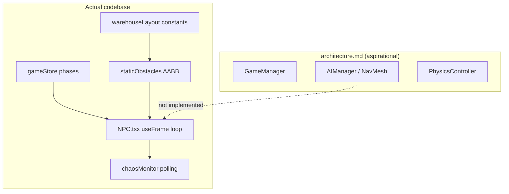
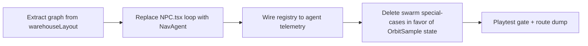
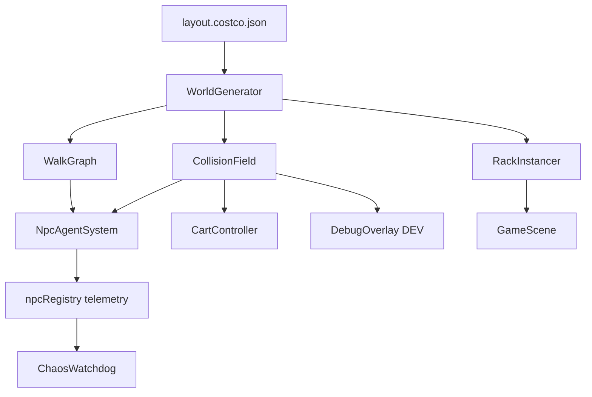
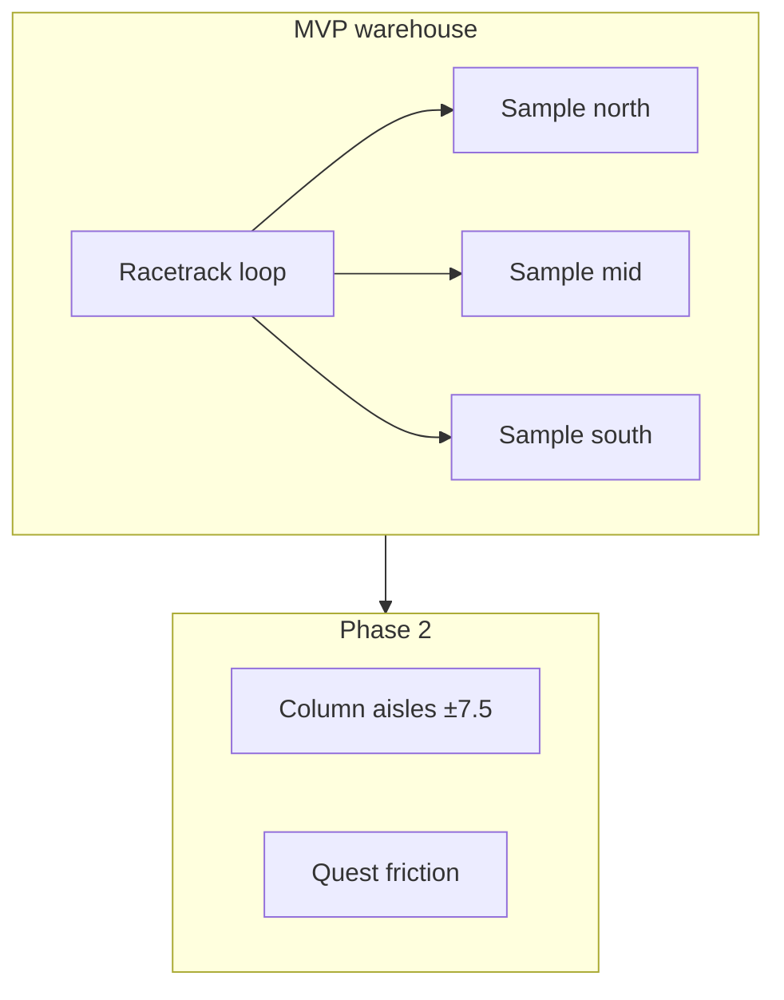

# Costco Chaos — CEO Rebuild Strategy & Agent Handoff Package

> **Prepared:** 2026-06-19  
> **Audience:** Project executive (Brandon) + successor implementation agent  
> **Status:** Route selection pending — reply with **1**, **2**, or **3** to unlock route-specific architecture docs  
> **Companion:** [`agent-handoff-fresh-start.md`](./agent-handoff-fresh-start.md) (technical inventory; will be rewritten after route pick)

---

## 1. Executive summary

Costco Chaos has a **playable skeleton** (parking → warehouse → samples → checkout prototype) but **failed on integration**: NPC patrol, rack collision, rack visuals, cart attachment, and the chaos watchdog were patched independently across ~15+ agent sessions. Each fix addressed a symptom; none established a **single geometry + navigation contract**.

The latest blocker — an NPC **jitter-stuck in the sample kiosk** while the watchdog reports **“No issues yet”** — is emblematic: grid patrol, sample swarm, kiosk obstacles, and monitor heuristics were never designed as one system.

**Recommendation preview:** Plan **2 (Greenfield Core)** scores highest on weighted criteria (see §5). Plan **1** is viable if timeline is tight and we accept one more structural sprint on the current tree. Plan **3** is the lowest-risk path to a **funny, shippable loop** but defers the “real Costco maze” vision.

---

## 2. Session post-mortem — revision log (chronological)

| # | User request / symptom | Agent action | Outcome | Still broken? |
|---|------------------------|--------------|---------|---------------|
| 1 | Handoff transition; docs alignment | Updated `handoff.md`, fixed stale `architecture.md` | Good onboarding doc | Docs drifted again within days |
| 2 | Branch + commit workflow | `cursor/customer-mh-proximity-collision` branch | Process OK | Large uncommitted delta accumulated later |
| 3 | Spawn in crosswalk → instant 0% MH | Moved `PLAYER_SPAWN` to `z: 18`, synced cart store | Fixed spawn | — |
| 4 | Port 5173 conflicts | `strictPort`, cheatsheet for `kill $(lsof -ti :5173)` | Dev UX OK | — |
| 5 | “Pedestrian cross” floating; not a real Costco maze | Web research; racetrack + cross-aisles in `warehouseLayout` | Layout improved | Still read as “one aisle” to user |
| 6 | Not tall enough; too dark; brown shelves; box products; NPCs need faces | Ceiling 9m, brighter materials, `ShopperAvatar` mesh | Visual pass | Low-poly look persists; not “modern shooter juice” |
| 7 | User: “almost like you didn’t execute anything” | Further layout/NPC churn | Frustration ↑ | Trust in incremental fixes collapsed |
| 8 | Racetrack perimeter patrol | `RACETRACK_LOOP`, `clampWarehouseNpcPoint`, loop lanes | Perimeter concept exists | Patrol X vs aisle X still confused |
| 9 | NPCs inside racks (visual) | **Root cause:** full-width rack meshes vs carved collision | `buildRackVisualChunks()` | Fixed visually if chunks stay synced |
| 10 | Watchdog spam `npc-stuck` at shared coords | Deduped routes; sample hunters → racetrack X | Reduced spam | New stuck points at junctions |
| 11 | Endpoint deadlocks at `±7.5` | `columnEndpoints` registry; one owner per segment | Mostly fixed | `wh-east-back` junction lingered |
| 12 | Cart on wrong end (all NPCs) | Flipped `gridPatrolHeading`, player-yaw convention, cart `±0.58` | **Multiple reversals** | **Still wrong in 4:54 PM screenshot** |
| 13 | Watchdog false negative (jitter loop at sample) | Net-displacement + micro-step jitter detection; grid jitter enabled | Partial | **Same NPC still stuck at sample table** |
| 14 | Sample table stuck specifically | Skip kiosk obstacles for `wh-sample-*`; teleport on escalation | Not verified | **User confirms still stuck** |

### Interpretation for the next agent

| Pattern | Evidence | Required invariant |
|---------|----------|-------------------|
| **Dual coordinate systems** | Aisle `±7.5`, racetrack `±13.1`, row-gap Z, kiosk at `x=0` | One **WalkabilityGraph** — no hand-tuned waypoints |
| **Collision ≠ rendering** | Carved AABB vs full mesh | Single `rackFootprint()` feeds collision, mesh, debug, watchdog |
| **Heading conventions forked** | Player `forward = (-sin, -cos)` vs NPC `gridPatrolHeading` vs `ShopperAvatar` flip | One **FacingConvention** doc + unit test |
| **Watchdog ≠ gameplay** | Monitor reads registry; NPC sets `paused`/`jittering` inconsistently | Watchdog consumes **NavAgent telemetry**, not ad-hoc flags |
| **Sample kiosk is a attractor + obstacle + patrol endpoint** | Kiosk at `x=0`; hunters on racetrack; zone columns cross Z | Kiosk = **no-go volume** in graph; hunters **orbit** at fixed ring nodes |

---

## 3. Current architecture (as-built) vs documented intent



| Layer | Documented | Built | Gap severity (1–5) |
|-------|------------|-------|---------------------|
| Navigation | AIManager + navmesh | Waypoint ping-pong + AABB slide | **5** |
| Layout | Maze-like Costco | Racetrack + 3 aisle columns + row gaps | **3** |
| NPC AI | Swarm, archetypes | Archetypes + swarm hook + grid patrol | **4** |
| Physics | Vehicle-lite cart | Manual AABB for cart/NPC; Rapier kinematic | **2** |
| QA | — | chaosMonitor (heuristic) | **4** |
| Visual parity | — | Visual chunks ≈ collision (recent) | **2** |

---

## 4. Known failure modes (priority ranked)

| ID | Failure | Root cause | User-visible | Fix class |
|----|---------|------------|--------------|-----------|
| F1 | NPC jitter at sample kiosk | Patrol segment intersects kiosk footprint; recovery reverses direction in-place | Stuck shopper in green ring | **Graph** — exclude kiosk nodes from through-traffic |
| F2 | Watchdog silent during jitter | Micro-moves reset timers; `paused` skips checks; registry lag | “No issues yet” | **Telemetry** — net displacement + mandatory agent state |
| F3 | Cart handle on wrong side | 3 competing yaw/offset conventions | All NPCs backwards | **Convention** — one transform chain, golden screenshot test |
| F4 | NPC inside rack (visual) | Was mesh width ≠ collision | Clip through steel | **Unified geometry** (partially fixed) |
| F5 | Endpoint deadlock | Shared `(x,z)` endpoints | Frozen clusters | **Route allocator** at generation time |
| F6 | Revision spiral | Per-NPC patches without invariant | Lost day of dev time | **Process** — route dump gate before merge |

---

## 5. Cost–benefit analysis (weighted)

### Criteria & weights (CEO-adjustable)

| Criterion | Weight | Definition |
|-----------|--------|------------|
| **Time to shippable loop** | 30% | Playable PARKING→SHOPPING→CHECKOUT with ≤2 known bugs |
| **Revision-nightmare risk** | 25% | Probability of another 5+ fix round on same subsystem |
| **Costco maze authenticity** | 20% | Reads as warehouse club, not gray tunnel |
| **Long-term maintainability** | 15% | Next agent can extend without reading 800 lines of `NPC.tsx` |
| **Humor / juice / polish ceiling** | 10% | Room for satire, audio, feedback without rewrite |

### Scoring (1–5 scale, higher = better)

| Plan | Time (30%) | Risk (25%) | Maze (20%) | Maint. (15%) | Polish (10%) | **Weighted** |
|------|------------|------------|------------|--------------|--------------|--------------|
| **1 — Surgical salvage** | 4 (×0.30 = 1.20) | 2 (×0.25 = 0.50) | 4 (×0.20 = 0.80) | 3 (×0.15 = 0.45) | 3 (×0.10 = 0.30) | **3.25** |
| **2 — Greenfield core** | 2 (×0.30 = 0.60) | 5 (×0.25 = 1.25) | 5 (×0.20 = 1.00) | 5 (×0.15 = 0.75) | 4 (×0.10 = 0.40) | **4.00** |
| **3 — Scope-down MVP** | 5 (×0.30 = 1.50) | 4 (×0.25 = 1.00) | 2 (×0.20 = 0.40) | 4 (×0.15 = 0.60) | 3 (×0.10 = 0.30) | **3.80** |

**Sensitivity:** If “time to loop” weight rises above 40%, Plan 3 wins. If “maze authenticity” rises above 30%, Plan 2 widens lead.

---

## 6. Three routes — CEO pitch (choose 1, 2, or 3)

### Plan 1 — Surgical salvage *(“Fix the engine, keep the paint”)*

**CEO brief:** Lowest migration cost. Keep `warehouseLayout.ts`, carved collision, parking lot, HUD, and sample kiosks. **Replace** `NPC.tsx` motion with a small state machine on a precomputed **walkability graph** (nodes = aisle intersections + racetrack corners; edges = cleared segments). One week of focused agent time, but **medium risk** of discovering a fourth hidden convention fork.

**Best if:** You want the current warehouse mesh and racetrack **now**, and can tolerate one disciplined “NPC v2” sprint with a hard no-patch policy.

---

### Plan 2 — Greenfield core, port assets *(“New foundation, same Costco”)**

**CEO brief:** Highest upfront cost, **lowest repeat failure risk**. New module `src/world/` owns layout JSON → graph → collision → debug overlay → NPC agents. Port visuals (textures, `ShopperAvatar`, parking), stores, and audio. Delete imperative patrol generators. Includes **mandatory** sim tests: route dump, golden screenshots, watchdog synthetic scenarios.

**Best if:** You refuse another day lost to jitter loops and want the next agent to execute from a **spec**, not archaeology.

---

### Plan 3 — Scope-down MVP *(“Ship the joke, grow the maze”)**

**CEO brief:** Shrink warehouse to **racetrack + 3 samples + 4 NPCs** (no grid patrol on `±7.5` until v2). Prove Mental Health comedy, sample [E], checkout drain, and watchdog on a **small nav graph** in days. Expand aisles once telemetry is green for 10 minutes straight.

**Best if:** Primary KPI is **a funny playable loop this week**, and the full maze is explicitly **Phase 2**.

---

## 7. Detailed system requests (implementation specs)

### Plan 1 — Surgical salvage

#### 7.1.1 Objectives

1. Eliminate F1–F3 without rewriting parking or rack rendering.
2. Freeze NPC count at ~12; no new routes until graph validator passes.
3. Watchdog must flag sample-table jitter within 5s in synthetic replay.

#### 7.1.2 Deliverables

| Deliverable | Acceptance test |
|-------------|-----------------|
| `WalkabilityGraph.ts` | Built from `warehouseLayout` only; nodes ≥ cross-aisles × patrol columns |
| `NavAgent.ts` | States: `Patrol`, `Yield`, `Recover`, `OrbitSample`; no `useFrame` > 200 lines |
| `FacingConvention.ts` | Player + NPC share helper; cart offset test renders handle toward −travel |
| Kiosk volumes | `SampleKiosk` registers `NO_GO` AABB; graph edges skip through volume |
| Watchdog v2 | Reads agent `netDisplacement5s`; fails CI script if stuck scenario not flagged |
| Route dump script | `npm run validate:routes` exits 0 |

#### 7.1.3 Explicit non-goals

- Navmesh baking library
- Checkout rewrite
- New art pass

#### 7.1.4 Migration steps



#### 7.1.5 Files touched (estimate)

| Keep | Replace / heavy edit | Delete logic |
|------|----------------------|--------------|
| `warehouseLayout.ts`, visual chunks, `staticObstacles` carve | `NPC.tsx` → thin wrapper | Per-id stuck hacks in `CulledNPC` |
| `ShopperAvatar`, stores, parking | `chaosMonitor.ts` | `usePlayerPushConvention` paths |
| Sample kiosks UI | `CulledNPC` route **allocation only** | Duplicate obstacle lists |

#### 7.1.6 Risk register

| Risk | Mitigation |
|------|------------|
| Graph misses racetrack edge | Visual debug overlay (DEV) drawing graph edges |
| Cart still backwards | Block merge until screenshot test on 3 patrol types |
| Time overrun | Cap at 2 agent sessions; fall back to Plan 3 subset |

---

### Plan 2 — Greenfield core, port assets

#### 7.2.1 Objectives

1. **Single source of truth:** `world/layout.costco.json` → graph → collision → Three meshes → Rapier (where needed).
2. NPCs are **agents on graph**, never raw coordinate arrays in configs.
3. Documentation-driven: agent executes from `docs/architecture-v2/` checklists, not conversation history.

#### 7.2.2 Module architecture



#### 7.2.3 `layout.costco.json` schema (minimal)

```json
{
  "columns": [{ "id": "west", "x": -7.5, "zMin": -11.25, "zMax": 10.75 }],
  "rowGaps": [-11.25, -5.75, -0.25, 5.25, 10.75],
  "racetrack": { "westX": -13.1, "eastX": 13.1 },
  "kiosks": [{ "id": "sample-mid", "x": 0, "z": -0.25, "noGoRadius": 2.2 }],
  "npcSlots": [
    { "type": "columnPatrol", "column": "west", "z0": "rowGaps[0]", "z1": "rowGaps[1]" }
  ]
}
```

#### 7.2.4 Deliverables

| Phase | Output | Gate |
|-------|--------|------|
| A — World | JSON + generator + debug draw | Graph connected; no orphan nodes |
| B — Player | Port cart controller against `CollisionField` | No rack clip |
| C — Agents | 12 NPCs from slots, no manual waypoints | `validate:routes` |
| D — Samples | Orbit behavior + player [E] | No agent inside `noGoRadius` |
| E — Watchdog | Scenario tests (frozen, jitter, in-rack) | All scenarios red in test |
| F — Port | Parking, HUD, audio, MH | 30s playtest script green |

#### 7.2.5 Port list (reuse as-is or lightly adapt)

- `ShopperAvatar.tsx`, `CartModel.tsx`, `FirstPersonCartCamera.tsx`
- `playerStore`, `uiStore`, `gameStore`, `sampleStationStore`
- `ParkingLot.tsx`, `parkingLotLayout.ts`
- Procedural textures, MH gauge, humor strings
- `cheatsheet.md`, port 5173 policy

#### 7.2.6 Explicit deletes (after port)

- Imperative `generateWarehouseNPCs` waypoint soup
- `gridPatrolHeading` / player-yaw dual convention
- Watchdog displacement heuristics without agent contract

#### 7.2.7 Documentation outputs (post-selection)

- `docs/architecture-v2/system-map.md`
- `docs/architecture-v2/navigation-contract.md`
- `docs/architecture-v2/geometry-pipeline.md`
- `docs/architecture-v2/watchdog-scenarios.md`
- Updated `agent-handoff-fresh-start.md` → **`agent-handoff-execute.md`**

---

### Plan 3 — Scope-down MVP

#### 7.3.1 Objectives

1. Shippable loop in **minimum surface area**.
2. Watchdog proven on **4 agents**, not 12.
3. Document expansion path to full maze (Plan 2 lite).

#### 7.3.2 MVP world spec

| Element | MVP scope | Deferred |
|---------|-----------|----------|
| Walkable space | Racetrack loop only (perimeter) | `±7.5` column patrol |
| NPCs | 4: 2 perimeter patrol, 2 sample orbiters | Quest cross-blockers |
| Samples | 3 kiosks, [E] restore, ring approach | Swarm from zone columns |
| Racks | Visual perimeter + simplified interior (decoys) | Full double-sided maze |
| Checkout | 12s drain win overlay | Lane AI |



#### 7.3.3 Deliverables

| # | Item | Done when |
|---|------|-----------|
| 1 | `mvpLayout.ts` — loop + 3 kiosk nodes | Player completes lap without clip |
| 2 | 4 `NavAgent`s with 2 states only | Watchdog 0 issues 10 min |
| 3 | Sample orbit radius enforced | No NPC mesh overlap kiosk |
| 4 | CEO playtest script pass | Brandon signs off on fun |
| 5 | `docs/phase2-expansion.md` | Graph extension points documented |

#### 7.3.4 Tradeoffs (explicit)

| Gain | Loss |
|------|------|
| Fast proof of humor + MH + samples | “One aisle” complaint may persist short-term |
| Trivial watchdog coverage | Quest list friction reduced |
| Clear agent scope | Less Costco authenticity until Phase 2 |

---

## 8. Information still required before build (any route)

| Item | Owner | Why |
|------|-------|-----|
| **Route choice 1/2/3** | CEO | Unlocks architecture-v2 docs |
| **Acceptable NPC count at launch** | CEO | 4 vs 12 affects Plan 3 vs 1/2 |
| **Checkout priority** | CEO | Real lane sim vs timed win |
| **Visual bar reference** | CEO | Screenshot or game reference for “modern juice” |
| **Revision budget policy** | CEO | e.g. “2 agent passes then escalate” |

---

## 9. Watchdog contract (all routes — non-negotiable)

The monitor failed because it observed **positions** without **agent intent**. Successor implementation must expose:

| Telemetry field | Type | Watchdog rule |
|-----------------|------|---------------|
| `state` | enum | Log on transition |
| `targetNodeId` | string | Stuck if unchanged >5s while state=`Patrol` |
| `netDisplacement5s` | number | `< 0.4m` → violation |
| `blockedReason` | string? | `kiosk`, `npc`, `rack` |
| `jitterScore` | number | `> threshold` → violation |

Synthetic scenarios (automated):

1. **Frozen** — agent paused in Recover  
2. **Jitter loop** — toggle direction at kiosk every 400ms  
3. **In rack** — teleport inside footprint  
4. **Quest in rack** — inventory item coords invalid  

---

## 10. Cart attachment contract (all routes)

Golden rule (to be enforced by test render):

```text
Travel direction T (normalized XZ)
Avatar faces T
Cart center at avatarOrigin + T * PUSH_OFFSET (0.58m)
CartModel handle end points toward avatar (local −Z on cart = handle)
```

**Forbidden:** separate player-yaw vs NPC-yaw tables without shared `travelYawFromDirection(dx, dz)`.

---

## 11. Sample kiosk contract (fixes F1)

| Rule | Detail |
|------|--------|
| Kiosk core | `noGo` disk radius **2.2m** at `(kiosk.x, kiosk.z)` |
| Graph edges | May **approach** orbit ring; may not **pass through** core |
| Hunter patrol | Racetrack column only; orbit ring node when `state=OrbitSample` |
| Zone columns | Must not use row-gap Z equal to kiosk Z **unless** graph proves clearance |
| Player [E] | Unchanged; radius 4.5m |

Current bug hypothesis (for next agent): **`wh-quest-3` or center column** patrol at `x=0` passes through `sample-mid` at `(0, ~-0.25)` — not a `wh-sample-*` id — so kiosk obstacle exclusion never applied. Grid patrol jitter recovery toggles direction at the kiosk plane.

---

## 12. Decision worksheet

| Question | Plan 1 | Plan 2 | Plan 3 |
|----------|--------|--------|--------|
| Days to first green playtest | 2–4 | 5–8 | 1–2 |
| Probability of repeat spiral | Medium | Low | Low |
| Keeps current rack art | Yes | Yes | Partial |
| Full maze soon | Yes | Yes | No (Phase 2) |
| Best watchdog reliability | Medium | High | High |

**Reply with `1`, `2`, or `3`.** Next deliverable: route-specific **`docs/architecture-v2/`** pack + rewritten **`agent-handoff-execute.md`** with phased checklists, mermaid system maps, and copy-paste agent system prompt.

---

## 13. Appendix — file inventory (current tree)

| Subsystem | Primary files | Health |
|-----------|---------------|--------|
| Layout | `warehouseLayout.ts` | Good constants; overcrowded |
| NPC spawn | `CulledNPC.tsx` | Fragile dedup logic |
| NPC motion | `NPC.tsx` (~580 lines) | **Critical debt** |
| Obstacles | `staticObstacles.ts` | Good carve; special cases |
| Watchdog | `chaosMonitor.ts` | Heuristic; incomplete |
| Avatar | `ShopperAvatar.tsx` | Convention unstable |
| Samples | `sampleStations.ts`, `SampleKiosk.tsx` | Kiosk ≠ nav |
| Player | `ShoppingCart.tsx`, `physicsController.ts` | OK |
| Docs | `handoff.md`, `architecture.md` | Partially stale |

---

## 14. Appendix — suggested agent system prompt (after route pick)

> You are implementing **Costco Chaos** route **[N]** per `docs/ceo-rebuild-strategy.md` and `docs/architecture-v2/*`.  
> **Do not** patch individual NPC ids.  
> **Do not** add waypoint coordinates without running `npm run validate:routes`.  
> **Do not** merge until watchdog scenarios pass.  
> Mental Health — never compliance. Customer with cart — never employee.  
> Port 5173 only. Ask before git commit.

(Full prompt expanded in `agent-handoff-execute.md` after selection.)

---

*End of strategy document — awaiting executive route selection.*
